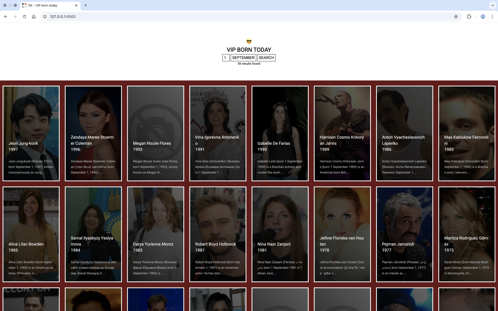

<p align="center">
  
</p>

---

# VIP Born Today

Ce projet permet d'afficher une liste de célébrités (VIPs) nées à une date spécifique (mois et jour) de l'année en utilisant des informations provenant de DBpedia, une base de données structurée de connaissances extraites de Wikipédia. L'interface utilisateur permet de sélectionner un mois et un jour pour voir les célébrités nées à cette date.

---

## 🎨 Fonctionnalités

- **Affichage dynamique des VIPs** : L'utilisateur peut choisir un mois et un jour pour afficher une liste de célébrités nées ce jour-là.
- **Recherche via SPARQL** : Le projet utilise une requête SPARQL pour interroger DBpedia et récupérer des informations sur les célébrités.
- **Cartes interactives** : Chaque célébrité est affichée sous forme de carte avec une photo, le nom, la date de naissance, et un extrait de sa biographie.

---

## Prérequis

- Navigateur web moderne (Chrome, Firefox, Edge, Safari, etc.)
- Connexion Internet pour récupérer les données de DBpedia.

---

## 🚀 Lancer le projet en local

1. Clonez ce repository sur votre machine locale :
   ```bash
   git clone https://github.com/ton-utilisateur/vip-born-today.git
   ```

2. Ouvrez le fichier index.html dans votre navigateur préféré pour voir l'application en action.

Aucun serveur ou environnement de développement n'est nécessaire pour exécuter ce projet localement.

---

## Utilisation

1. **Sélectionner un mois** : Utilisez le menu déroulant pour choisir un mois de l'année.
2. **Sélectionner un jour** : Après avoir sélectionné un mois, choisissez un jour dans le deuxième menu déroulant.
3. **Rechercher** : Cliquez sur le bouton "Rechercher" pour afficher les célébrités nées à la date choisie.
4. **Résultats** : Les résultats seront affichés sous forme de cartes avec des informations telles que la photo, le nom de naissance, l'année de naissance et un extrait de la biographie.

---

## ⚙️ Structure du projet
```bash
/vipborntoday
│
├── /assets
│   ├── /images            #Un dossier contenant une image pour les célébrités dont la photo n'est pas disponible.
│   ├── /styles/style.css  #Le fichier CSS pour la mise en forme de l'interface (facultatif, si utilisé).
│   ├── /scripts/script.js  #Le fichier JavaScript contenant la logique pour interagir avec l'interface utilisateur et récupérer les données de DBpedia.
│
└──  index.html  #Le fichier principal contenant l'interface utilisateur.
```
---

## 🛠️ Technologies utilisées

- **HTML** : Structure de la page web.
- **CSS** : Pour la mise en forme de l'interface (si applicable).
- **JavaScript** : Logique de l'application, gestion des événements, et récupération des données via l'API SPARQL de DBpedia.
- **DBpedia** : Base de données utilisée pour récupérer des informations sur les célébrités.

---

## 💻 Contribuer

Si vous souhaitez contribuer à ce projet, n'hésitez pas à ouvrir une **pull request** ou à soumettre des **issues**. Toutes les contributions sont les bienvenues !

---

## 📫 Contact

Pour toute question, suggestion ou autre, vous pouvez me contacter via les moyens suivants :

- **Email**: [elmahdi.korfed@gmail.com](mailto:elmahdi.korfed@gmail.com)
- **LinkedIn**: [https://www.linkedin.com/in/elmahdikorfed/](https://www.linkedin.com/in/elmahdikorfed/)
